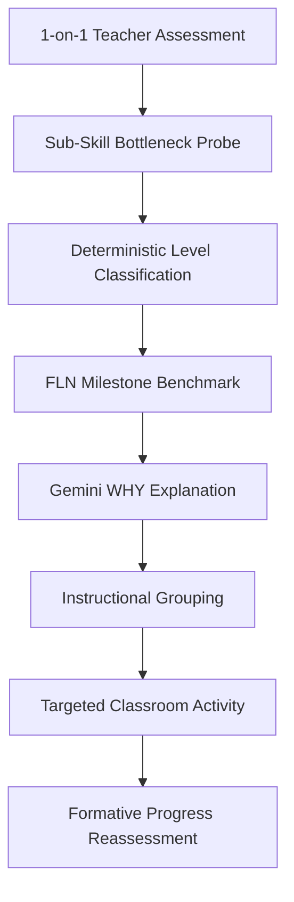
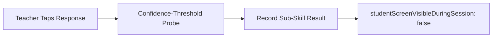
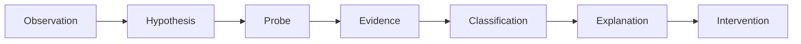

# 🦉 PRAGYA — see the child, not the grade

> **ASER-inspired, teacher-administered FLN diagnostic for PS-E01 (KALACHAKRA 2K26)**


---

> [!IMPORTANT]
> **READ THIS FIRST — CRITICAL GUARDRAILS & DISCLAIMERS**
> - **Affiliation Disclaimer:** NIPUN Intelligence is an independent prototype inspired by publicly available ASER DIYA assessment methodology. It is not an official ASER, Pratham, NCERT, or NIPUN Bharat product.
> - **Synthetic Data Only:** Every learner in this repo is a generated profile (Synthetic Learner S001...S040). No real child names, no real school identifiers, no real response data, and no school-system access was used or sought.
> - **Teacher-Led Diagnostic:** Following the ASER DIYA method, the diagnostic is teacher-administered, one-on-one, oral/card-based. The teacher uses the tablet to guide the session and tap each response; the system investigates in the background. The student screen is shown only after assessment, as a personal gamified journey.
> - **Deterministic Classification:** Core classification is deterministic and explainable. Gemini is used only to draft plain-language teacher explanations and intervention activities, never to decide a child's level.
> - **No Public Ranking:** No public ranking, ever. Formative framing: a level is current demonstrated skill, never a permanent label; reassessment always allowed.
> - *We turn a term of guesswork into tomorrow's lesson plan.*

---

## 🌟 1. Overview & The Subtraction Thesis

**PRAGYA** bridges the "Grade-Level Illusion" in primary classrooms. A Class 5 register reveals age and attendance, but hides real reading and numeracy levels: two children sitting in the exact same row can be three learning levels apart. 

PRAGYA closes this visibility gap with a 5-minute teacher-led check that outputs a sub-skill profile and an immediate, non-ranking classroom action plan.

> **The Subtraction Thesis:** *We removed the child from the diagnostic screen and removed the LLM from the classifier.*

---

## ❗ 2. The Problem Statement (PS-E01)

| Fact / Metric | Context & Source Tag |
|---|---|
| **649,491 children / 17,997 villages** | Evaluated nationwide in ASER 2024 survey **[SOURCE FACT]** |
| **16.3% (2022) → 23.4% (2024)** | Class 3 govt school children reading Class 2 text—best ever recorded **[SOURCE FACT]** |
| **> 3/4 Children** | Still cannot read a text two grades below their enrolled grade **[SOURCE FACT]** |
| **Wide Internal Variation** | Persistent, hidden learning distribution inside every single classroom **[SOURCE FACT]** |
| **~5 minutes / <= 12 items** | Target duration & item limit for 1-on-1 diagnostic **[DESIGN TARGET]** |

---

## 💡 3. Five Contrarian Product Choices

1. **Teacher in the Loop / Child Off Screen:** The diagnostic is an oral, 1-on-1 interaction. The child never looks at a digital test screen during evaluation.
2. **Deterministic Classifier / LLM Explainer Only:** Core level decision trees use rule-based code for 100% auditability and zero hallucination risk. LLMs explain insights, they never grade.
3. **Sub-Skill Profile / Never One Aggregate Score:** Evaluates foundational milestones (Letter, Word, Paragraph, Story) rather than producing a single misleading percentage.
4. **Bottleneck Investigation / Not Blame:** Pinpoints the exact sub-skill breakdown (e.g. phoneme blending vs. vocabulary memory) to guide instruction.
5. **Grouped by Need / Never Ranked:** Automatically generates targeted instructional groups for peer-led learning without publicly sorting children.

---

## 🎯 4. Core Surfaces

### 👩‍🏫 Teacher Surfaces
| Surface Name | Primary Purpose |
|---|---|
| **Command Center** | Single-screen view of today's classroom action plan & diagnostic status |
| **Classroom Learning Map** | Heatmap distribution of learning levels (unsorted to prevent ranking) |
| **Assessment Conductor** | 1-on-1 tablet interface for recording student responses |
| **Learning DNA & WHY Panel** | Detailed sub-skill bottleneck breakdown and AI-driven pedagogical explanations |
| **Instructional Groups** | Automated grouping recommendations based on identified learning needs |

### 👶 Student Surfaces
| Surface Name | Primary Purpose |
|---|---|
| **My Learning World** | Gamified learning journey map for post-assessment exploration |
| **My Quest & Practice Zone** | Interactive practice activities (*Note: Practice Zone is NOT the diagnostic*) |
| **Achievements** | Non-competitive milestone badges celebrating personal growth |

---

## 🧠 5. Architecture & Diagnostic Workflows

### (a) Diagnostic Core Loop


### (b) Assessment Conductor Workflow


### (c) Learning Investigator Workflow


---

## ⚙️ 6. Tech Stack & Engine

| Layer | Technology & Role |
|---|---|
| **App Framework** | Next.js 16 (App Router), React 19, TypeScript |
| **Styling** | Vanilla CSS Tokens + Tailwind CSS (Cream design palette) |
| **Database & Auth** | Supabase Auth (Client, Server, Middleware) + PostgreSQL |
| **Diagnostic Kernel** | Deterministic adaptive & classification engine (`src/lib/nipun/`) |
| **AI Assist** | Gemini API — explanation & copilot ONLY, never the classifier (with fallbacks) |
| **Visualizations** | Recharts, Framer Motion, `@xyflow/react` |


---

## 📂 7. Project Structure

```text
src/
 ├── app/
 │    ├── (auth)/             [KEEP - Auth routes]
 │    ├── (dashboard)/        [Teacher routes: Command Center, Upload, etc.]
 │    ├── student/            [Student post-assessment gamified portal]
 │    └── api/                [Assessment, Groups, Copilot, & Demo APIs]
 ├── components/
 │    ├── dashboard/          [Teacher Command Center & Sidebar]
 │    └── nipun/              [Student gamified components]
 ├── lib/
 │    ├── gemini.ts           [KEEP - Gemini client]
 │    ├── geminiService.ts    [Gemini explanation service]
 │    └── nipun/              [Deterministic FLN engine & synthetic data]
 └── utils/
      └── supabase/           [KEEP - Supabase client, server, & middleware]

README.md
```

---

## 🔮 8. Future Scope & Roadmap (Not in MVP)

- **Numeracy Parity:** Full expansion of math diagnostic modules.
- **Optional Speech-to-Text:** Voice assist for teacher evaluation support.
- **Multilingual Item Bank:** Integration with regional language frameworks (Bhashini-style).
- **Progress-over-Time Trends:** Longitudinal tracking across academic quarters.
- **School & District Aggregate Dashboards:** High-level administrative analytics.
- **Consented Real-World Field Pilot:** Evaluated with real classrooms upon institutional approval.

---

## 👥 9. Team Responsibilities

| Role | Responsibility | Member |
|---|---|---|
| **Product-Problem Lead** | Child-off-screen framing & PS-E01 alignment | [FILL_NAME] |
| **Assessment-Data Lead** | Question bank, synthetic data generator, & validation | [FILL_NAME] |
| **Algorithm Lead** | Deterministic adaptive engine, bottleneck investigator | [FILL_NAME] |
| **Teacher-UX Lead** | Command Center, Classroom Map, Conductor, & WHY Panel | [FILL_NAME] |
| **Chassis-Integration Lead** | Repo conversion, Supabase Auth/RLS, & Gemini integration | [FILL_NAME] |

---

## 🚀 10. Installation & Local Setup

```bash
# Clone the repository
git clone https://github.com/Dhanushcodehub/Pragya.git

# Navigate to project directory
cd Pragya

# Install dependencies
npm install

# Start development server
npm run dev
```

*Note: Seed the demo with synthetic data via `/api/demo` or the "Generate Demo Class" option — no real child data is required or accepted.*

---

## 📸 11. Screen Previews

- **Command Center:** `[REPLACE_WITH_REAL_CAPTURE]`
- **Assessment Conductor (Child Off-Screen):** `[REPLACE_WITH_REAL_CAPTURE]`
- **Classroom Learning Map (Heatmap):** `[REPLACE_WITH_REAL_CAPTURE]`
- **WHY Panel & Learning DNA:** `[REPLACE_WITH_REAL_CAPTURE]`
- **Student Quest View:** `[REPLACE_WITH_REAL_CAPTURE]`

---

## 🏆 12. Vision

> *PRAGYA isn't another AI tutor. It is a teacher's eyes on the hidden variation inside a single classroom. The value is never the test; it is the conversion of hidden learning variation into actionable teacher information.*

---

Independent prototype inspired by publicly available ASER DIYA methodology. Not an official ASER / Pratham / NCERT / NIPUN Bharat product. Synthetic data only. Built for KALACHAKRA 2K26, EdTech & Learning Innovation, PS-E01 'The Grade-Level Illusion'.
